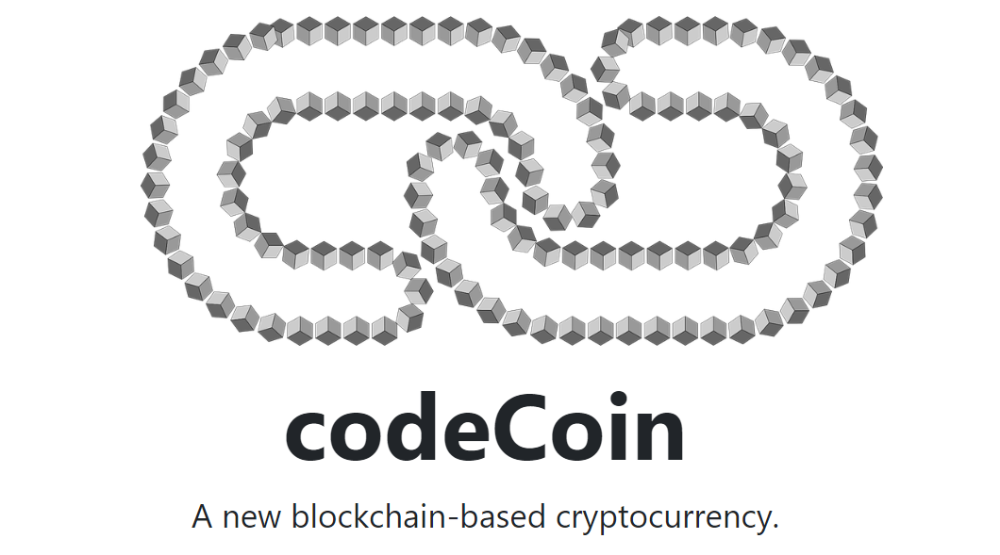
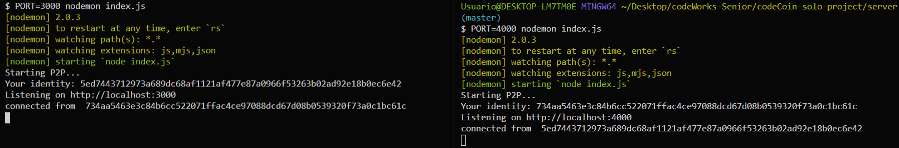
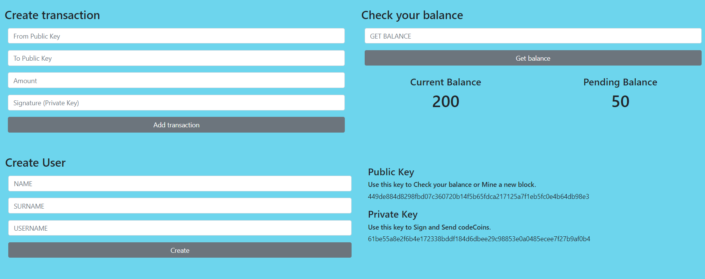
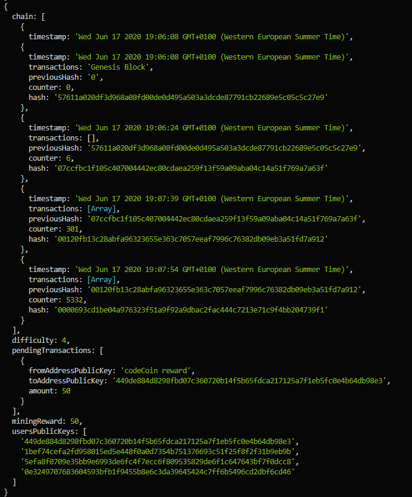

## Built With

### Front-end

* [React](https://reactjs.org/)
* [Bootstrap](https://getbootstrap.com/)

### Back-end

* [Javascript](https://www.javascript.com/)
* [Nodejs](https://nodejs.org/en/)
* [Peer-to-peer](https://es.wikipedia.org/wiki/Peer-to-peer)

## What is Blockchain?

* [Blockchain](https://en.wikipedia.org/wiki/Blockchain)

## Getting Started

### Prerequisites

For this project you need:

```
Nodejs
```

### Installing

Go to codeCoin-solo-project/server and run:

```
npm install
```

Now you can run the server. I recommend to run two servers in different ports. The connection P2P will link the different ports. You can use any port but remembre that later we will run react in port 3000. For example, run:

```
PORT=5000 nodemon index.js
PORT=4000 nodemon index.js
```



Now you can go to codeCoin-solo-project/client/codecoin-react and install all the react dependencies:

```
npm install
```

## Running React

In the folder /codeCoin-solo-project/client/codecoin-react/src run:

```
npm start
```

Now you can use codeCoin!



You can mine new blocks. If you are not familiar with blockchain-mining, check this documentation:

* [Mining blocks](https://www.investopedia.com/terms/b/bitcoin-mining.asp)


### Result

If you open your terminal you will see the codeCoin-blockchain:



## Future Features

I am working to create a data base with:

* [MongoDB] (https://www.mongodb.com/)
* [Redis] (https://redis.io/)


## Author

* **danisan9490**
